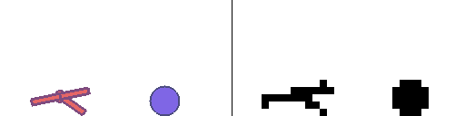
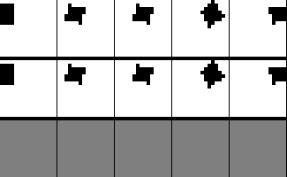
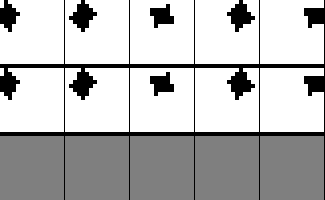
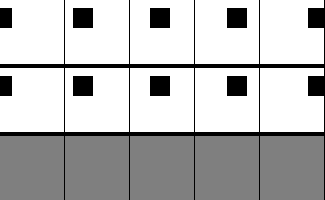
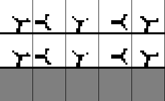
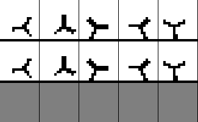
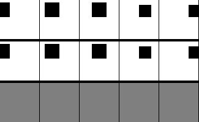
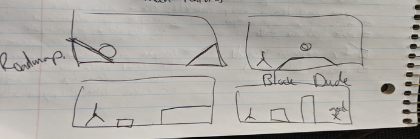

boxLCD 📟
=================

**[Installation ‍💻](#installation-)** | **[Demos ⚽](#environment-demos-)** | **[Training examples 📉](#training-examples-)** | **[Roadmap 📍](#roadmap-)** | **[Related Work 📚](#related-work-)**

boxLCD is box2D physics with low resolution and binarized rendering. It provides sample
environments and an API for defining and rendering custom environments.

The aim of this project is to accelerate progress in [learned simulator](https://matwilso.github.io/learned-sims/) and world model research,
by providing a simple testbed for learning predictive dynamics models of physics environments.
Eventually we care about predictive models that are trained on real world data and that help robots act in the real world.
However, we believe these is a lot of fundamental research to do before we can realize that [full vision](https://matwilso.github.io/robot-future/),
and that small scale testbeds are very useful for making progress.

<!--
boxLCD can be thought of as something akin to MNIST, but for learning dynamics models in robotics.
Generating MNIST digits is not very useful and has become fairly trivial.
But it provides a simple first task to try ideas on and it lets you iterate quickly and build intuition.
Learning dynamics models of 2D physics with low resolution images is not very useful and will be trivial
compared to learning models of the real world.
But it provides a much more tractable starting point, both for the field as a whole, as well as individuals starting out in the area.
-->

boxLCD is somewhat of a minimum viable product at this point.
It's currently useful for testing out simple generative models, but it is limited in scope.
For more of the reasoning behind it and future plans, see the [Roadmap](#roadmap-).

## Installation ‍💻

I recommend cloning the repo and experimenting with it locally, as you may want to read through things and customize them.

```
git clone https://github.com/matwilso/boxLCD.git
cd boxLCD
pip install -e .
pip install -r requirements.txt
```

## Environment demos ⚽

```python
from boxLCD import envs, C  
env = envs.Dropbox(C)  # C is a default configuration that you can modify
obs = env.reset()
while True:
    action = env.action_space.sample()
    obs, _, done, info = env.step(action)
    env.render(mode='human')
```

Pretty rendering vs LCD rendering (upscaled for visualization) |  
:-------------------------:|
`envs.Dropbox()` (16x16) | 
  |  
`envs.Bounce()` (16x16) | 
  |  
`envs.Urchin()` (16x16) | 
  |  
`envs.UrchinBall()` (16x24) | 
  |  
`envs.UrchinBalls()` (16x32) | 
  |  
`envs.UrchinCubes()` (16x32) | 
  |  


## Training examples 📉


To demonstrate what is possible with boxLCD, we train a [model](./examples/model.py) on a few simple environments using a naive approach.

Our model is a temporally masked Transformer trained to predict the next frame given all past frames.
It is similar to a language model (e.g., GPT), but each token is simply the flattened 2D image for that timestep.
To train the model, we feed those flat image tokens in, the model produces independent Bernoulli distributions for
each pixel in the frame, and we optimize these distributions to match the ground truth (loss = -logp). 
To sample the model, we prompt it with the start 10 frames of the episode, and have it predict the rest autoregressively.


See [examples](./examples) for scripts to recreate the gifs below.
In the gifs, the top is ground truth, middle is model prediction, and bottom is the error between the two (this visualization approach is copied from Dreamer).
The results below were trained on a single NVIDIA GTX 1080Ti desktop machine.

| | Training Results for datasets of 10k rollouts |   |
|:---:|:-------------------------:| :-------------------------:|
|`envs.Dropbox`| 10 epochs |  100 epochs |
|episode length: 100<br/># of parameters: 4.5e5<br/>training time: **3 minutes 25 seconds** |  |   |
|`envs.Bounce()`| 10 epochs | 100 epochs |
|episode length: 200<br/># of parameters: 4.7e5<br/>training time: **6 minutes 29 seconds** |  |   |
|`envs.Urchin()`| 10 epochs | 100 epochs |
|episode length: 200<br/># of paremeters: 2.5e6<br/>training time: **16 minutes 16 seconds** |  |   |

This is an extremely simplistic approach and it has to generate the entire frame of pixels at once by sampling them independently.

We do not condition on or predict the continuous proprioceptive state information, because I haven't gotten that working yet.
I find using Gaussians leads to very bad autoregressive samples.
Discrete sampling works much better out of the box.

### Urchin
The Urchin task is actually a bit tricky and the model started to overfit the smallish dataset of 10k rollouts in this experiment.
The robot is 3-way symmetric, and since we are only using images here, the model is continually forced to
identify which leg corresponds to which index in the action vector based on past observations and actions.
We also randomly sample the actions for the 3 joints at each time step, so the agent can't rely on a semi-fixed policy
to narrow down the state space it has to cover.

(note: this is just an illustration of how far you can get with little effort. i expect you can do much better if you tried)

### Intelligent Domain Randomization
Because powerful generative models will have to model uncertainty in the environment, sampling them should give intelligent domain randomization.
Instead of randomizing over a bunch of wacky parameters, the model will be tuned to the underlying distribution and only produce variety you might actually see in the real world.

For a crude demonstration of this idea, I created an environment that simulates either a falling
box or a bouncing ball. Since these shapes are sometimes indistinguishable at low resolution, the model 
cannot tell them apart given the prompt, so it should sample each option some fraction of the time.
(For a real world example, you may not know the mass of an opaque container, so your model should sample over a range of possible masses.)

Below is an example where the expected behavior occurs.
On the far left, the model samples a ball instead of a box.
On the 4th to the right, the model samples a box instead of a ball.

 

## Roadmap 📍

Some of the reasoning behind this project can be found in some blog posts I have written on 
the [future of robot learning](https://matwilso.github.io/robot-future/), and [learned simualtors](https://matwilso.github.io/learned-sims/).

boxLCD aims to serve as a testbed that accurately captures the challenge of future learned simulators:
- **physics-based.** unlike some past testbeds, robots and objects don't move magically. they are governed by consistent physics and joints must be actuated.
- **pixel-based.** robots in the real world primarily sense the world through vision (pixels), so we use pixels.
- **multi-modal sensing.** robots also have other sensors like joint encoders and inertial measurement units (IMUs) that provide high quality information, so we provide proprioceptive information and we're working on ways to fuse several sources of information to make better predictions.
- **partially observable.** sensors don't tell the full story of the world. robots constantly have to make estimates of state that you only observe indirectly. given prompts, we're exploring the ability to sample reasonable continuations given all knowledge.
- **interfaceable.** along with the sensors commonly available to robots, these systems should be able to interface with other structured information. given a mesh, a natural language or structured description of a scene, these systems should be able to incorporate that information to make better predictions. for example, feeding in the mesh of a partially occluded object should let the model identify the object and make better predictions about how the object moves in the future. we plan to design tasks that test for this.

At the same time, boxLCD aims to remain computationally tractable and easy to work with:
- **2d physics settings.** box2d physics shares some similar properties with real world physics (contacts, friction, gravity), but it is very simplified.
- **simple rendering.** boxLCD enables color and variable sized rendering, but the default envs use at most a `16x32 = 544` sized binary images (smaller than MNIST)
- **programmatic and customizable.** boxLCD lets you geneate new scenarios and customize the environments to different settings you want to test.

boxLCD is in active development.
At the moment, we are focused on developing environments and training models with the sole purpose of learning accurate physics models (not solving goals).
I do believe that pushing on accuracy purely will be highely correlated with useful models.
But in the future, we plan to expand this scope and design tasks that leverage our learned models.

### Future Features
- goal-based envs that leverage our models
  - maybe something like [block dude](https://www.calculatorti.com/ti-games/ti-83-plus-ti-84-plus/mirageos/block-dude/) but fully physics based
- more robots and varied objects
- support for scrolling (environments which do not fit on the screen all at once)
- static environment features like ramps and walls
- maybe multiple image channels to represent these different layers 
- envs that challenge the ability to interface with information about a scene, like descriptions of properties of multiple objects and inferring which properties describe which object
- more formal benchmarks and bits/dim baselines



## Related Work 📚

There are several related benchmarks that are worth noting.
However, I'm not aware of any work with the same goals as boxLCD, nor one that simultaneously satisfies the same criteria.

### Video prediction

- [BAIR Pushing Dataset](https://www.tensorflow.org/datasets/catalog/bair_robot_pushing_small). 44k examples of robot pushing objects in a bin. 64x64x3 sized frames.
- [RoboNet](https://www.tensorflow.org/datasets/catalog/robonet). 15M video frames from 113 unique camera views. Like a scaled up version of BAIR Pushing, but on many robots and from different views. 64x64x3 sized frames.
- [Moving MNIST](https://www.tensorflow.org/datasets/catalog/moving_mnist). MNIST digits that are animated to move and bounce off the walls of a 64x64 sized frame.

### Physics/embodied environments

- [PHYRE: A Benchmark For Physical Reasoning](https://phyre.ai/). A variety of simmple classical mechanics puzzles. Has fairly rich environments and dynamics, but only enables taking a single action at the beginning of an episode, and there's no robot.
- [Simulated Billiards](https://haozhi.io/RPIN/). Billiards environment. Similar to PHYRE, you only take a single action.
- [Ilya's bouncing balls dataset](https://papers.nips.cc/paper/2008/hash/9ad6aaed513b73148b7d49f70afcfb32-Abstract.html). Kind of interesting to look at something from back in the day. These were not binarized, slightly larger frames. The RTRBM (Recurrent Temporal Restricted Boltzmann Machine) produces decent tracking results, but they aren't that crisp (collisons are gooey. in supplementary, compare samples 1.gif,2.gif with the training data 5.gif).
- [Habitat sim](https://github.com/facebookresearch/habitat-sim). "A flexible, high-performance 3D simulator for Embodied AI research". Focused on things like navigation, instruction following, and question answering. Not very physics-based as far as I can tell.
- [Gibson environment](https://github.com/StanfordVL/GibsonEnv). "Real-World Perception for Embodied Agents". You can load robots in and they can walk around in realistic looking scenes.
- [AI2-THOR environment](https://ai2thor.allenai.org/). Realistic scenes, Unity 3D physics, has simulated and real world counterparts.
- [DeepMind Lab](https://github.com/deepmind/lab). 3D learning environment based on Quake III engine. This is often used in video prediction work, especially from Alphabet.

### Other miniaturized environments and datasets
- [MinAtar](https://github.com/kenjyoung/MinAtar). Miniature versions of 5 Atari games, played on 10x10 grids.
- [MNIST-1D](https://github.com/greydanus/mnist1d). "A 1D analogue of the MNIST dataset for measuring spatial biases and answering 'science of deep learning' questions."
- [Procgen](https://openai.com/blog/quantifying-generalization-in-reinforcement-learning/). Procedurally generated and smallish scale environments for testing generalization of RL algorithms. 

If you think I'm missing anything here, let me know.
