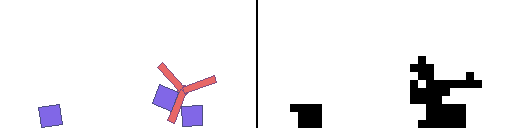

boxLCD 📟
=================

boxLCD uses box2D physics with extremely low resolution and binarized rendering. It provides an API
and sample environments which you can use to develop methods for learning dynamics models.

The aim of this project is to accelerate progress in learned simulator and world model research,
by providing a simple testbed for developing and quickly iterating on predictive modeling ideas.
Eventually we care about systems that are trained on real world data and that help robots act in the real world.
But it seems that we have a lot of fundamental research to do before this is possible.

You can think of it roughly like an MNIST for learned simulators.
Generating MNIST digits is not very useful and has become fairly trivial, compared to generating high-resolution images of faces, for example.
But it provides a simple first task to try ideas on and it lets you iterate quickly and build intuition.
boxLCD aims to provide a similar service, but for learning dynamics models in robotics.

**Table of Contents**
- [Installation ‍💻](#installation-)
- [Demos ⚽](#demos-)
- [Training results 📈](#training-results-)
- [Roadmap 📍](#roadmap-)
- [Related Work 📚](#related-work-)

## Installation ‍💻

I recommend cloning the repo and experimenting with it locally, as you may want to customize the environments or the API.

```
git clone https://github.com/matwilso/boxLCD.git
cd boxLCD
pip install -e .
pip install -r requirements.txt
```

## Demos ⚽

```python
from boxLCD import envs
env = envs.Dropbox() # for example
obs = env.reset()
while True:
    action = env.action_space.sample()
    obs, _, done, info = env.step(action)
    env.render(mode='human')
```

Pretty rendering &#124; LCD rendering |  
:-------------------------:|
`env = envs.Dropbox()` (16x16) | 
  |  
`env = envs.Bounce()` (16x16) | 
  |  
`env = envs.Urchin()` (16x16) | 
  |  
`env = envs.UrchinBall()` (16x24) | 
  |  
`env = envs.UrchinBalls()` (16x32) | 
  |  
`env = envs.UrchinCubes()` (16x32) | 
  |  


## Training results 📈
TODO: error plots of lcd, and predictions of it

(description)

This is an extremely simplistic approach and it is not able to sample latent features.
It has to generate all pixels at once.

 approach I am using is extremely simple, and it doesn't allow
very nice sampling in some latent space that corresponds. It has to sample all of the pixels
at once. 

### Automatic Domain Randomization 🎲
`env = envs.BoxOrCircle()` (16x16) 

I claim in my learned simulators post that powerful generative models will have to
model uncertainty in the environment and so then sampling from them will be identical to domain randomization.

For a rough simple test case of this, I can create an environment that simulates either a circle
or a box shape. Since these shapes are sometimes indistinguishable at low resolution, the model has no
way of knowing which shape it is dealing with given only 5 starting frames.

My model is extremely simple and must sample all pixels at once.
Even, so it can sometimes sample both scenarios.

Cherry picked example. See the far right 2 examples, where the model happens to sample the wrong shape.

 

Non-cherry picked example, on the far sides, you can see it kind of waffles between bouncing and not.

 

## Roadmap 📍

Some of the reasoning behind this project can be found in some blog posts I have written on 
the [future of robot learning](https://matwilso.github.io/robot-learning/future/), and [learned simualtors](https://matwilso.github.io/robot-learning/learned-sims/).

boxLCD tries to capture some key properties of future learned simulators:
- physics based. unlike past related work, robots and objects don't move magically. they are governed by consistent physics and joints must be actuated to propel the robot.
- vision. in the real world, you can't directly observe the state of the world. you primarily sense it through vision (pixels).
- partial observability + modeling uncertainty. even what you can currently see doesn't tell the full story of the world. you constantly have to make estimates of state that you only observe indirectly. because of this, you enable:
  - making reasonable continuations of physics prompts that are plausible given all knowledge. and reasonable sampling over unknowns
  - automatic domain randomization. by modeling uncertainty, you can sample and then get samples that coverage the true distribution of variation in the space.
- enable loading of structured information into predictions, like feeding meshes, natural language descriptions. 

While being computational tractable and easy to work with:
- narrow 2d physics settings, at least to start out.
- simple rendering. boxLCD enables variable sized rendering, but the default envs use a maximum `16x32 = 544` sized binary images (smaller than MNIST). compared to datasets like the [BAIR Pushing dataset](https://www.tensorflow.org/datasets/catalog/bair_robot_pushing_small) with `64x64x3 = 12288` sized RGB images, this represents a 24x descrease in floating point numbers on the input and output. And information-wise, `24*8bits=`192x decrease in the bits to process, which can matter especially for naive PixelCNN type approaches.
- programmatic and customizable. you can geneate new scenarios and customize the environments to different settings you want to test.

boxLCD is in active development.
Right now, we are focused on developing environments and training models solely to predict accuracte physics, given past observations and actions.

### Future Features
- goal-based tasks and leverage our models to quickly learn to solve them.
  - maybe something like [block dude](https://www.calculatorti.com/ti-games/ti-83-plus-ti-84-plus/mirageos/block-dude/) but full physics based
- more robots and varied objects
- support for scrolling (environments which do not fit on the screen all at once)
- static environment features like ramps and walls
- maybe multiple image channels to represent these different layers 
- more formal benchmarks and bits/dim baselines

## Related Work 📚

https://github.com/kenjyoung/MinAtar

There are some related work, like moving MNIST. But that doesn't have control in it. Also this is lower dim.
https://www.tensorflow.org/datasets/catalog/moving_mnist

Doom and Berkeley dataset are other examples. But they are higher res and less configurable.
They also don't have associated structured information.

This is not like anything else exists. It is explicitly targeting the world models
and learned simulator task and provides low dimensional stuff. It allows custom environment interaction
to test custom scenarios. You incorporate robot actions and robot proprioception with partial observations,
as we will have in the real world.

- targeting learned simulator and world model research goals
- extremely low-res and binary for quick iteration speed
- video prediction, integrated with robot action *and* proprioception, as will be the case in the real world
- greater access to the simulator to enable custom scenarios, not just a fixed set of envs. but more general settings

This is explicitly building to the goal of learned sims and world models.

Background knowledge pointer to faq


https://haozhi.io/RPIN/

https://phyre.ai/
This one you set the state of the environment and then you see it roll out.
This is unlike robotics where you act at every timestep.
It is a narrow setting where you take one action and see what happens for many steps.

Also taking actions at every step is way harder to learn.
This creates many possible ways states can diverge. You can't rely
on them following a sequence, which is much easier.

Ilya bouncing balls. Back in the day though, these were not binarized, slightly larger.
And the RTRBM (Recurrent Temporal Restricted Boltzmann Machine) produces results that are not crisp.
The balls move, but the collisions are gooey (in supplementary, compare 1.gif,2.gif with the training data 5.gif).
https://papers.nips.cc/paper/2008/hash/9ad6aaed513b73148b7d49f70afcfb32-Abstract.html

Basically the point is this project is trying to approximate something very specific.
No previous work are trying to learn simulators or world models like this.
And the details and what you aim for matter. 
We think this aims most closely at an interesting goal
We think this has the greatest pareto front / product / AUC of aiming to the goal and being more approachable with small budgets.


https://github.com/greydanus/mnist1d
https://greydanus.github.io/2020/12/01/scaling-down/

This is not that similar, but has the shared goal of focusing on iteration speed.
We should focus on things that will scale. It may not help a ton for what actually ends
up scaling, but it gives a good place to build intuitions and fundamentals.

