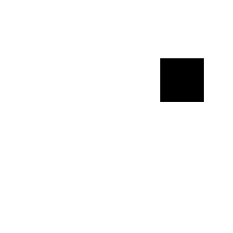

# box2d_challenge

# box_lcd_challenge

Box2D simulation with very simple B/W LCD rendering. And super simple graphics for low computational budgets and quick
iterations of ideas.

Meant to develop ideas of learned simulators and world models on a general simulation environment
with simple 2D graphics and B&W 

Meant to simulate as closely as possible the challenges that will be faced in developing powerful learned world models.

name ideas:
- baw_sim (b/w sim)
- box_lcd
- lcd_sim
- mnist_sim

