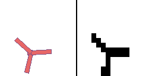

# boxLCD 📟
<!--## *box2D physics with low-res and binarized rendering*-->

The aim of this project is to accelerate progress in [learned simulator and world model research](https://matwilso.github.io/robot-learning/future/),
by providing a simple testbed for developing and quickly iterating on predictive modeling ideas.
Eventually we care about systems that are trained on real world data and that help robots act in the real world.
But we have a lot of fundamental research to do before this is possible.

boxLCD uses box2D physics and uses extremely low resolution and binarized rendering.
And provides sample robot environments which you can use to try to learn to cover the physics with much fewer computational resources.

I think a decent analogy is MNIST. Generating MNIST digits is trivial and not very useful, compared to generating high-resolution images of faces, for example.
But it provides a simple first task to try ideas on and it lets you iterate quickly and build intuition.
boxLCD aims to sort of be like an MNIST for learned simulators / world models.

boxLCD tries to capture some key properties of future learned simulators:
- physics based. unlike past similar work, robots and objects don't move magically. they are governed by consistent physics and joints must be actuated to propel the robot.
- vision. in the real world, you can't directly observe the state of the world. you primarily sense it through vision (pixels).
- partial observability + modeling uncertainty. even what you can currently see doesn't tell the full story of the world. you constantly have to make estimates of state that you only observe indirectly. because of this, you enable:
  - making reasonable continuations of physics prompts that are plausible given all knowledge. and reasonable sampling over unknowns
  - automatic domain randomization. by modeling uncertainty, you can sample and then get samples that coverage the true distribution of variation in the space.
- enable loading of structured information into predictions, like feeding meshes, natural language descriptions. 

boxLCD is in active development.
Right now, we are focused on developing environments and training models solely to predict accuracte physics, given past observations and actions.
In the future, we plan to set up goal-based tasks and leverage our models to quickly learn to solve them.

## Installation

I recommend cloning the repo and experimenting with it locally, as you may want to customize the environments or the API.

```
git clone https://github.com/matwilso/boxLCD.git
pip install -e .
pip install -r requirements.txt
```

## Demos

```
from boxLCD import envs
env = envs.Dropbox() # for example
obs = env.reset()
while True:
    action = env.action_space.sample()
    obs, _, done, info = env.step(action)
    env.render(mode='human')
```

Pretty rendering &#124; LCD rendering |  
:-------------------------:|
`env = envs.Dropbox()` (16x16) | 
  |  
`env = envs.Bounce()` (16x16) | 
  |  
`env = envs.Urchin()` (16x16) | 
  |  
`env = envs.UrchinBall()` (16x24) | 
  |  
`env = envs.UrchinBalls()` (16x32) | 
  |  
`env = envs.UrchinCubes()` (16x32) | 
  |  


## Training
TODO: error plots of lcd, and predictions of it

(description)

This is an extremely simplistic approach and it is not able to sample latent features.
It has to generate all pixels at once.

 approach I am using is extremely simple, and it doesn't allow
very nice sampling in some latent space that corresponds. It has to sample all of the pixels
at once. 

### Automatic Domain Randomization
`env = envs.BoxOrCircle()` (16x16) 

I claim in my learned simulators post that powerful generative models will have to
model uncertainty in the environment and so then sampling from them will be identical to domain randomization.

For a rough simple test case of this, I can create an environment that simulates either a circle
or a box shape. Since these shapes are sometimes indistinguishable at low resolution, the model has no
way of knowing which shape it is dealing with given only 5 starting frames.

My model is extremely simple and must sample all pixels at once.
Even, so it can sometimes sample both scenarios.

Cherry picked example. See the far right 2 examples, where the model happens to sample the wrong shape.

 

Non-cherry picked example, on the far sides, you can see it kind of waffles between bouncing and not.

 

## Future Roadmap:
- adding goals for moving objects to certain locations
  - maybe something like [block dude](https://www.calculatorti.com/ti-games/ti-83-plus-ti-84-plus/mirageos/block-dude/) but full physics
- support for scrolling, static environment features like ramps and walls
- maybe multiple image channels to represent these different layers 
- more formal benchmarks and bits/dim baselines?