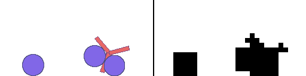

# boxLCD 📟
<!--## *box2D physics with low-res and binarized rendering*-->

The aim of this project is to accelerate progress in [learned simulator and world model research](https://matwilso.github.io/robot-learning/future/),
by providing a simple testbed for developing and quickly iterating on predictive modeling ideas.

It seeks to provide as close an analog as possible to the eventual goal scenario where
we are learning predictive models of the real world and using these as learned simulators
or world models for training robots to operate more effectively in the real world.
While remaining tractable to train and quickly iterated on ideas using very limited computational resources (it's nice
if you can at least run initial experiments with a single desktop GPU machine).
Operating on high-res images from robots in the real world is expensive.
So here then we aim to create the closest possible aGnalog to the problems we will face in the
future while keeping it extremely tractable.

boxLCD uses box2D physics and uses extremely low resolution and binarized rendering.

This is a crude analog, and many aspects of the real world complexity are missing.
I think a good analogy for what boxLCD is trying to do for learned simulators is what generating MNIST digits is
in generative modeling. Generating MNIST digits is trivial compared to generating high-resolution images of faces for example.
But it provides a very simple testbed for developing ideas, the cores of which ideas are useful for tasks you actually care about.
In this direction, you must get the overall structure of the problem right.
MNIST can help if all you care about is generating still images. But if you want
to develop methods that deal with video, you need something like moving MNIST or BAIR dataset.
So boxLCD tries to get as close to the real world setting as possible:
- physics based. robot doesn't move magically, but has to actuate all its joints
- can't directly observe objects and the environment. use images
- robots have cameras + proprioception and they take robot actions. the real world is going to have to fuse multiple sources of sensor data.
- uncertainty. physics are fairly consistent, but there are unobservable properties of the world. you must represent uncertainty

- modeling uncertainty, making reasonable continuations of physics prompts that are plausible given all knowledge. and reasonable sampling over unknowns
- enable loading of structured information into predictions


boxLCD is in active development.
It is going to be driven by a loop which involves me developing environments,
training networks that can accurately predict those environments.
And then iterating on the process to develop more powerful models and using them to.

Right now, the goal is just predict the physics accurately given past states and actions.
In the future, I plan to set up tasks that then have a goal that they use this


It is in active development, but it currently supports.
It offers a few basic sample environments and a limited wrapper around the pybox2d API to make defining custom b2worlds easier.

This is mostly just to test out ideas and prototype. So I expect to make this much better.


// TODO: create examples of bounce, dropbox, robots with varieties. w/ both pyglet and lcd rendering.

I think framing this, building this, and working on it will end up being valuable.


## Usage

TODO: colab notebook

TODO: cloning and requirements and example of how to run different envs and stuff.

`pip install -e .`

(Maybe not require cloning)

## Demos

```
from boxLCD import envs
env = envs.Dropbox() # for example
obs = env.reset()
while True:
    action = env.action_space.sample()
    obs, _, done, info = env.step(action)
    env.render(mode='human')
```

Pretty rendering vs. LCD rendering for the demo environments |  
:-------------------------:|
`env = envs.Dropbox()` (16x16) | 
  |  
`env = envs.Bounce()` (16x16) | 
  |  
`env = envs.Urchin()` (16x16) | 
  |  
`env = envs.UrchinBall()` (16x24) | 
  |  
`env = envs.UrchinBalls()` (16x32) | 
  |  
`env = envs.UrchinCubes()` (16x32) | 
  |  

TODO: error plots of lcd, and predictions of it

## Future Roadmap:
- tasks of moving object
- block dude tasks. support for scrolling, static environment features like ramps and walls