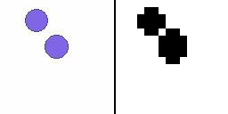
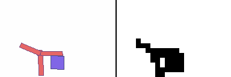
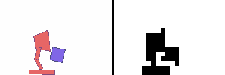
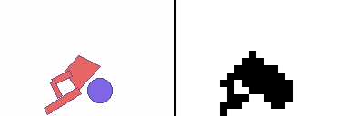

boxLCD 📟
=================

**[Installation ‍💻](#installation-)** | **[Demos ⚽](#environment-demos-)** | **[Model learning 📉](#model-learning-)** | **[Reinforcement learning 📈 ](#reinforcement-learning-)** | **[Roadmap 📍](#roadmap-)** | **[Related Work 📚](#related-work-)**

boxLCD is box2D physics with low resolution and binarized rendering. It provides sample
environments and an API for defining and rendering custom environments.

The aim of this project is to accelerate progress in [learned simulator](https://matwilso.github.io/learned-sims/) and world model research,
by providing a simple testbed for learning predictive dynamics models of physics environments.
Eventually we care about predictive models that are trained on real world data and that help robots act in the real world.
However, we believe these is a lot of fundamental research to do before we can realize that [full vision](https://matwilso.github.io/robot-future/),
and that small scale testbeds are very useful for making progress.

boxLCD is meant to vary from extremely simple environments with low resolution, binarized rendering, and
low frames per second (FPS) / frequency (Hz) for getting started, to increasingly complicated environments that push
the capabilities of current methods more. You can think of it kind of like a video game skill tree, which
starts with the challenge of predicting video of simple physics environments and expands outwards from there in several directions.
For more of the reasoning behind it and future plans, see the [Roadmap](#roadmap-).

<!--
It is designed around a skill tree, progressive difficulty setup. 
Each step in the tree represents increased difficulty of task.
For getting started, you begin at the base. Or if you have some specific task in mind,
you can skip to that point in the tree and work on it.
You can see the tree and the increasing difficulty here: TODO.

(maybe include the skill tree right here. idk.)
--->

<!--
boxLCD can be thought of as something akin to MNIST, but for learning dynamics models in robotics.
Generating MNIST digits is not very useful and has become fairly trivial.
But it provides a simple first task to try ideas on and it lets you iterate quickly and build intuition.
Learning dynamics models of 2D physics with low resolution images is not very useful and will be trivial
compared to learning models of the real world.
But it provides a much more tractable starting point, both for the field as a whole, as well as individuals starting out in the area.
-->


## Installation ‍💻

I recommend cloning the repo and experimenting with it locally, as you may want to read through things and customize them.

```
git clone https://github.com/matwilso/boxLCD.git
cd boxLCD
pip install -e .
pip install -r requirements.txt
```

## Environment demos ⚽

```python
from boxLCD import envs  
env = envs.Dropbox()  # for example
obs = env.reset()
while True:
    action = env.action_space.sample()
    obs, _, done, info = env.step(action)
    env.render(mode='human')
```

Tier 0: Basic Passive Objects |  Tier 1: Simple Robots and Manipulation |  
:-------------------------:|:------:|
`envs.Dropbox()` (16x16) | `envs.Urchin()` (16x32) | 
  |    |  
`envs.Bounce()` (16x16) | `envs.Luxo()` (16x32) | 
  |    |  
`envs.Bounce2()` (16x16) | `envs.UrchinCube()` (16x24) | 
  |    |  
`envs.Object2()` (16x16) | `envs.LuxoCube()` (16x24) | 
  |    |  
\- | `envs.UrchinBall()` (16x24) | 
\- |   |  
\- | `envs.LuxoBall()` (16x24) | 
\- |   |  


## Model learning 📉

After 100k iterations on a datset of 100k rollouts.
Green is prompt, red is model prediction. Top is ground truth, middle is model prediction, bottom is error.

RSSM is from modified from [Dreamer v1](https://danijar.com/project/dreamer/) code.
Flat Binary Transformer pre-trains a binary autoencoder latent vectorl.
Then each of those vectors is a token in a transformer that is trained to predict the next token autoregressively.
 
RSSM Predictions | 
:-------------------------:|
`envs.Dropbox()` (16x16) | 
  | 
`envs.Bounce()` (16x16) |
  | 
`envs.Bounce2()` (16x16) |
  |
`envs.Object2()` (16x16) |
  | 

Flat Binary Transformer Predictions | 
:-------------------------:|
`envs.Urchin()` (16x32) | 
  | 
`envs.Luxo()` (16x32) |
  | 
`envs.UrchinCube()` (16x24) |
  |
`envs.LuxoCube()` (16x24) |
  | 

### Reinforcement learning 📈

We use the Flat Binary Transformer above as a reinforcement learning environment (blue lines)
and compare it to learning directly in the base simulator (red lines).
The goal is to reach the body goal shown in white.
We find that policies trained in the learned simulator do nearly as well
in the base simulator as policies trained in the base simulator.

Ep Return curves show values during training (in real simulator and learned simulator, respectively).
Success rate curves show evaluation on the real environment during training.
\* values are success rates from evaluating policy at convergence with N=1000.


Urchin Learned Env Policy | 
:-------------------------:|
Running In the Learned Env | 
  | 
Transferring Directly to the Base Simulator | 
  | 

Luxo Learned Env Policy | 
:-------------------------:|
Running In the Learned Env | 
  | 
Transferring Directly to the Base Simulator | 
  | 


## Roadmap 📍

Some of the reasoning behind this project can be found in some blog posts I have written on 
the [future of robot learning](https://matwilso.github.io/robot-future/), and [learned simualtors](https://matwilso.github.io/learned-sims/).

boxLCD aims to serve as a testbed that accurately captures the challenge of future learned simulators:
- **physics-based.** unlike some past testbeds, robots and objects don't move magically. they are governed by consistent physics and joints must be actuated.
- **pixel-based.** robots in the real world primarily sense the world through vision (pixels), so we use pixels.
- **multi-modal sensing.** robots also have other sensors like joint encoders and inertial measurement units (IMUs) that provide high quality information, so we provide proprioceptive information and we're working on ways to fuse several sources of information to make better predictions.
- **partially observable.** sensors don't tell the full story of the world. robots constantly have to make estimates of state that you only observe indirectly. given prompts, we're exploring the ability to sample reasonable continuations given all knowledge.
- **interfaceable.** along with the sensors commonly available to robots, these systems should be able to interface with other structured information. given a mesh, a natural language or structured description of a scene, these systems should be able to incorporate that information to make better predictions. for example, feeding in the mesh of a partially occluded object should let the model identify the object and make better predictions about how the object moves in the future. we plan to design tasks that test for this.

At the same time, boxLCD aims to remain computationally tractable and easy to work with:
- **2d physics settings.** box2d physics shares some similar properties with real world physics (contacts, friction, gravity), but it is very simplified.
- **simple rendering.** boxLCD enables color and variable sized rendering, but the default envs use at most a `16x32 = 544` sized binary images (smaller than MNIST)
- **programmatic and customizable.** boxLCD lets you geneate new scenarios and customize the environments to different settings you want to test.

<!--
Qualitatively, you can deal with the sequence learning and logic task independent of high resolution
and getting the textures right. So it decouples the problem a bit and makes things simpler.
-->

### Future Features
- support for scrolling (environments which do not fit on the screen all at once)
- static environment features like ramps and walls
- more challening robots and varied objects, which likely require higher resolution and maybe color to fully distinguish.
- maybe multiple image channels to represent these different layers 
- maybe something like [block dude](https://www.calculatorti.com/ti-games/ti-83-plus-ti-84-plus/mirageos/block-dude/) but fully physics based
- envs that challenge the ability to interface with information about a scene, like descriptions of properties of multiple objects and inferring which properties describe which object
- more formal benchmarks and bits/dim baselines
- adding modality of sound. possibly through some pseudo-sound signal. like some simple and short waveform if the robot's limb hits the ground. for a bouncing ball, it would be a different waveform with amplitude proportional to distance from robot.
- perhaps stochastic delays in observations and stuff like that
- safety constraints to respect, to emulate constraints of real world (like can't be too hard on the robot or it will break)
- more evaluations of learned simulators, like how can we leverage them (for building curriculum, specifying goals, etc.)
- lifelong learning tasks that tests the ability to remember from episode experience how to do a task many steps later. not terminating the environment basically ever.
- tests for temporal abstraction. if we crank up the FPS and have tasks that require longer horizon thinking, this makes it harder for single step RL to work, so it would help select for methods that do better at temporal abstraction.
- some scaling law analysis. is there something we can say about how the complexity of an environment relates to the size of model needed to learn it well? like just how GPT3 picks up grammar, maybe you need a certain size of model to pick up object permanence. On the fact that objects retain identity over time. Maybe you could see in a more advanced model this notion of objects retaining identity. You could construct deliberately fucked up samples (like maybe an object that changes identity, midway through. And you do this by hacking boxLCD). And then you see if the model responds to this. Like baby surprisal.
- baby surprisal
- tying more envs together. like creating a setting in which there are many possible robots and objects that could be simulated.


## Related Work 📚

There are several related benchmarks that are worth noting.
However, I'm not aware of any work with the same goals as boxLCD, nor one that simultaneously satisfies the same criteria.

### Video prediction

- [BAIR Pushing Dataset](https://www.tensorflow.org/datasets/catalog/bair_robot_pushing_small). 44k examples of robot pushing objects in a bin. 64x64x3 sized frames.
- [RoboNet](https://www.tensorflow.org/datasets/catalog/robonet). 15M video frames from 113 unique camera views. Like a scaled up version of BAIR Pushing, but on many robots and from different views. 64x64x3 sized frames.
- [Moving MNIST](https://www.tensorflow.org/datasets/catalog/moving_mnist). MNIST digits that are animated to move and bounce off the walls of a 64x64 sized frame.

### Physics/embodied environments

- [PHYRE: A Benchmark For Physical Reasoning](https://phyre.ai/). A variety of simmple classical mechanics puzzles. Has fairly rich environments and dynamics, but only enables taking a single action at the beginning of an episode, and there's no robot.
- [Simulated Billiards](https://haozhi.io/RPIN/). Billiards environment. Similar to PHYRE, you only take a single action.
- [Ilya's bouncing balls dataset](https://papers.nips.cc/paper/2008/hash/9ad6aaed513b73148b7d49f70afcfb32-Abstract.html). Kind of interesting to look at something from back in the day. These were not binarized, slightly larger frames. The RTRBM (Recurrent Temporal Restricted Boltzmann Machine) produces decent tracking results, but they aren't that crisp (collisons are gooey. in supplementary, compare samples 1.gif,2.gif with the training data 5.gif).
- [Habitat sim](https://github.com/facebookresearch/habitat-sim). "A flexible, high-performance 3D simulator for Embodied AI research". Focused on things like navigation, instruction following, and question answering. Not very physics-based as far as I can tell.
- [Gibson environment](https://github.com/StanfordVL/GibsonEnv). "Real-World Perception for Embodied Agents". You can load robots in and they can walk around in realistic looking scenes.
- [AI2-THOR environment](https://ai2thor.allenai.org/). Realistic scenes, Unity 3D physics, has simulated and real world counterparts.
- [DeepMind Lab](https://github.com/deepmind/lab). 3D learning environment based on Quake III engine. This is often used in video prediction work, especially from Alphabet.

### Other miniaturized environments and datasets
- [MinAtar](https://github.com/kenjyoung/MinAtar). Miniature versions of 5 Atari games, played on 10x10 grids.
- [MNIST-1D](https://github.com/greydanus/mnist1d). "A 1D analogue of the MNIST dataset for measuring spatial biases and answering 'science of deep learning' questions."
- [Procgen](https://openai.com/blog/quantifying-generalization-in-reinforcement-learning/). Procedurally generated and smallish scale environments for testing generalization of RL algorithms. 

If you think I'm missing anything here, let me know.
